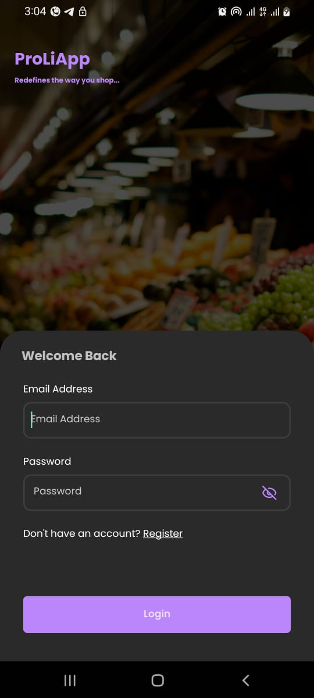
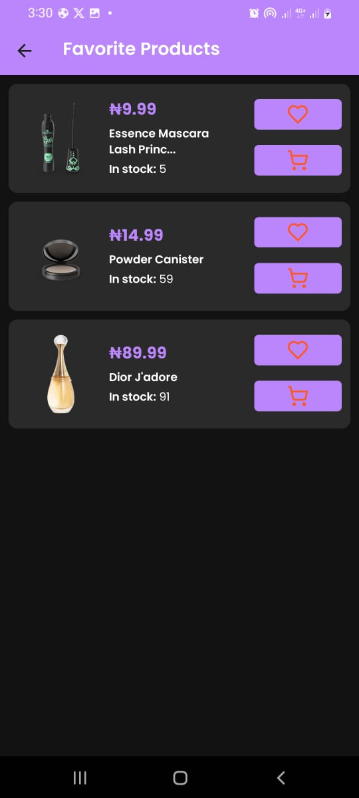

# React Native Test Assignment: Product Listing Application

## Objective
This project is a React Native-based Product Listing Application. The app interacts with a product API to display a list of products, handles user authentication with login and registration screens, and stores user data locally using AsyncStorage.

## Features
- **User Authentication**: 
  - User registration and login with data stored in AsyncStorage.
  - Persistent user sessions.
  - Logout functionality to clear user data and navigate back to the login screen.
  
- **Product Listing**:
  - Fetch products from the DummyJSON API.
  - Display product details like image, title, description, and price.
  - Implement pagination or infinite scroll for large product lists.
  
- **Product Details**:
  - Display detailed information about a selected product.
  - "Add to Favorites" feature using AsyncStorage to save favorite products locally.

- **Navigation**:
  - Seamless navigation between Login, Registration, Product Listing, and Product Details screens using React Navigation.

## Requirements
- **React Native CLI**
- **React Navigation** for managing in-app navigation.
- **AsyncStorage** for local data storage.
- **DummyJSON API** for fetching product data.

## Screens
- **LoginScreen**: User login interface.
- **RegisterScreen**: User registration interface.
- **ProductsScreen**: Displays a list of products fetched from the API.
- **ProductScreen**: Shows detailed information for a selected product.

## Installation

1. **Clone the repository:**
   ```bash
   git clone https://github.com/peterchijioke/ProLiApp.git
   cd PrLiApp

### Install dependencies:

```bash
npm install
```

or

```bash
yarn install
```
### Start the Metro Bundler

```bash
npx react-native start
```

### On Android
```bash
npx react-native run-android
```
### On iOS
```bash
npx react-native run-ios
```
## Usage

1. **Register a new user** using the Registration screen.
2. **Log in** with the registered credentials.
3. After logging in, you'll be redirected to the **Product Listing Screen** where you can browse the available products.
4. Click on a product to view its details on the **Product Details Screen**.
5. **Add a product to your favorites** using the "Add to Favorites" button.
6. **Logout** using the logout button, which will clear your session data and redirect you back to the **Login screen**.

## API Integration
The application integrates with the DummyJSON API to fetch and display product data. Error handling is implemented to manage network issues and other potential errors.

## APK
https://drive.google.com/file/d/1m1t5kotGAAnjp66QaUvZAs9Mvdxy1q6j/view?usp=sharing

## Screenshots






## Demonstration
A short video demonstrating the following:

User registration and login.
Navigation through the Product Listing and Product Details screens.
Adding a product to favorites and viewing the list of favorite products.


